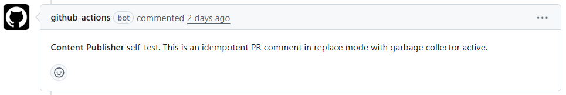
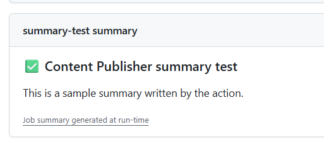

# Content Publisher (GitHub Action)

Publish content to GitHub surfaces with modes `add | upsert | replace | append`, and optional garbage collection of duplicates.  

Channels supported:

- `pull-request` → sticky or non-sticky **PR comment**.
- `summary` → **Job Summary** of the current job.
- `check-run` → updates the title of the of the check-run of the current job (when is used for validation).

## Inputs

- `channel` (required): `pull-request | summary | check-run`
- `mode` (required): `add | upsert | replace | append`
- `body` (optional): inline content (Markdown).
- `body-file` (optional): file path to read the content from. If both `body` and `body-file` are set, `body` wins.
- `marker-id` (optional): used to identify the message (sticky). If not set, an auto-generated marker is used.
- `pr-number` (optional): overrides PR autodetection.
- `append-separator` (optional): used in `append` mode to separate existing content from the new one. 
- `garbage-collector` (optional, default `false`): when `true`, removes duplicate entries with the same marker (keeps the most recent).
- `fail-on-error` (optional, default `true`). When `false`, the Action will not fail if the publication fails (e.g. due to API limits), but will log the error instead.
- `github-token` (optional): override token; by default uses `GITHUB_TOKEN`.

## Outputs

- `published`: `true|false`.
- `channel`: echo of the selected channel.
- `resource-id`: `comment_id` or `check_run_id` when applicable
- `mode-effective`: the resolved mode.

## Permissions

- `check-run`: requires `permissions: checks: write`.
- `pull-request`: requires `permissions: issues: write`.
- `summary`: requires no additional permissions.

## Examples

### PR sticky upsert (recommended with body-file)

```yaml
- name: Publish PR comment (sticky upsert)
uses: CorrenSoft/github-content-publisher@v0
with:
  channel: pull-request
  mode: upsert
  marker-id: plan
  body-file: ./out/plan.md
```

### PR Append

```yaml
- name: Append section to PR comment
  uses: CorrenSoft/github-content-publisher@v0
  with:
    channel: pull-request
    mode: append
    marker-id: coverage
    append-separator: '\n\n---\n\n'
    body: |
      - Added coverage for module X
```

### Job Summary

```yaml
- name: Publish Job Summary
  uses: CorrenSoft/github-content-publisher@v0
  with:
    channel: summary
    mode: add
    body-file: ./out/report.md
```

### Check Run

```yaml
permissions:
  contents: read
  checks: write

steps:
  - name: Publish Check Run
    uses: CorrenSoft/github-content-publisher@v0
    with:
      channel: check-run
      mode: upsert        
      body: |
        All the tasks were completed.
```

## Extended behavior details

- `pull-request`
  - Creates or updates an issue comment on the PR identified by `pr-number` (explicit) or auto-detected from event payload.
  - Uses a marker line (`<!-- content-publisher: ... -->`) from `marker-id` or repo context to identify and manage sticky comments.
    - If missing, a marker is auto-generated based on workflow name to avoid conflicts across different usages. In scenarios with multiple comments (either by the same or by multiple workflows), using explicit `marker-id` is recommended for better management.
  - `add`: always creates a new comment.
  - `upsert`: updates the matching marker comment if found, otherwise creates a new one.
  - `replace`: deletes the matched marker comment (if any), then creates a new one.
  - `append`: adds new content to the matched marker comment (or creates it if missing).
    - The marker is only added at the beginning on the first publication; subsequent append operations keep a single marker and add the separator + new content.
    - A separator is added to, well, separate the new and the existing content. Is none is provided in `append-separator` parameter, the default is `\n\n---\n\n`.
  - When `garbage-collector=true`, duplicate marker comments are deleted (keeps the first found match and removes rest). Not applicable in `add` mode. 

    

- `summary`
  - Writes the body to summary of the job.
  - `mode` is ignored within this channel.

    

- `check-run`
  - Patches the output title/summary of the current job with provided body.
  - The content is visible in the check-run details of the pull request, if the job is used to validate it.
  - `mode` is ignored; effective mode is always `upsert`.

    

- Content handling
  - The content is taken from `body` or `body-file` and is used as-is, without any parsing or manipulation by the Action. 
  - Any desired formatting must be applied before passing the content to the Action.
  - The Action does not control the length of the content, which may cause API rejections if too long.
